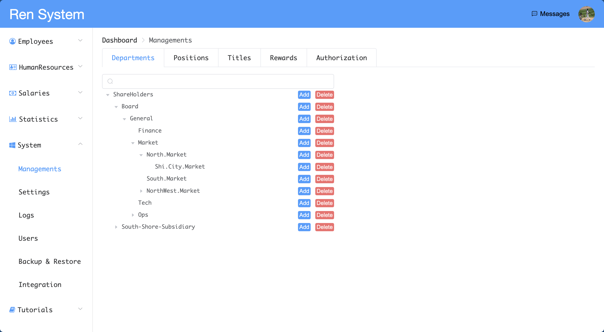
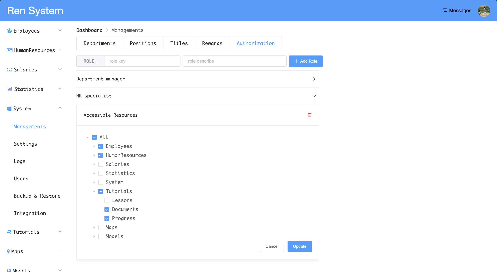
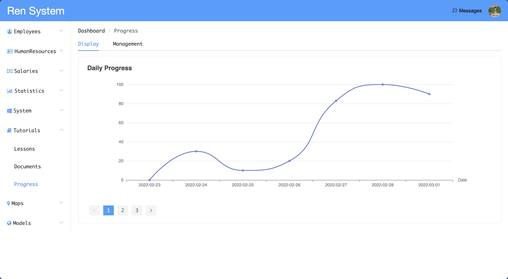
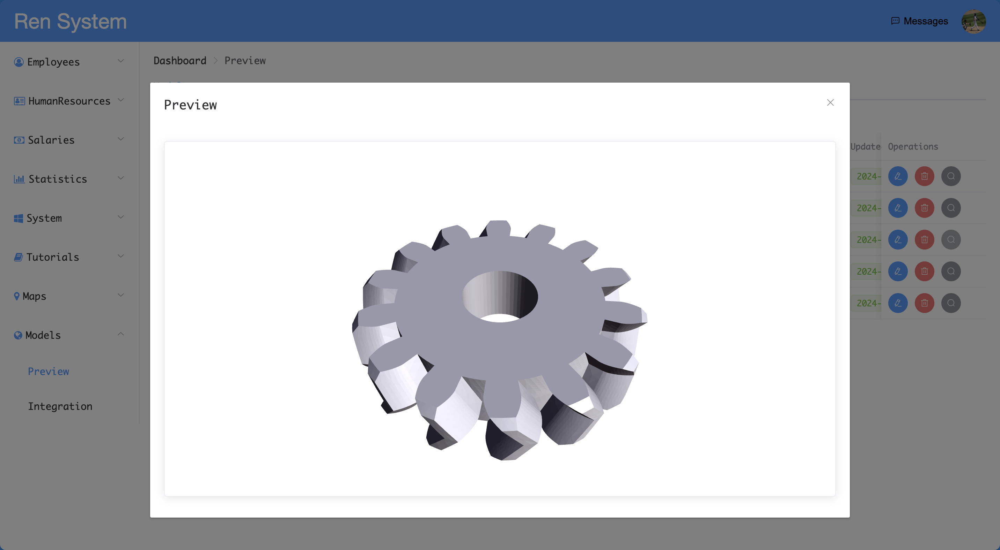
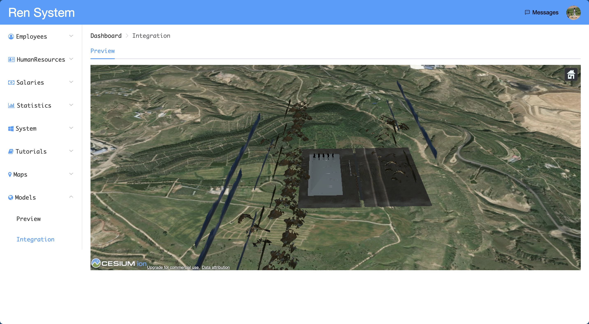

# VCher

## Introduction

This is a secondary development project based on [lenve/vhr](https://github.com/lenve/vhr). The original project is a one-stop, user-friendly open-source management system that uses role-based access control (RBAC) design principle. It has an active community and a well-established ecosystem. As an enhancement, I have added features including chart presentations, 3D model previews, POI (points of interest) management on maps, and the integration of 3D models into maps.

## Frameworks Used

- **Backend:** Spring Boot, Spring Security, MyBatis, MySQL, Redis, RabbitMQ, Spring Cache, WebSocket, etc.
- [**Frontend:**](https://github.com/egu0/vcher-web) Vue, ElementUI, axios, Vue-router, Vuex, WebSocket, Vue-3d-model, etc.

## Features

- **RBAC Resource Management:** The system uses Role-Based Access Control (RBAC) to manage resources. Each user is assigned one or more roles, and each role is granted several module permissions. The user's menu is dynamically generated based on their roles.
- **CSV File Import and Export:** The employee management module integrates the Apache POI tool to support import and export functionalities.
- **Email Sending:** The system integrates email sending capabilities using RabbitMQ middleware and Freemarker template tools. When an email needs to be sent, the system first places the message into the RabbitMQ middleware's message queue, and then a consumer uses the template engine to generate and send the email.
- **Course Resource Management:** This module includes features for managing attachments, links and progress. The progress management feature uses the [Echart](https://echarts.apache.org/en/index.html) tool on the frontend to visually display data changes.
- **Model Management:** This module includes model preview and integration with [Cesium](https://cesium.com/) models. For the Cesium model integration, we can preview how existing models are displayed on a 3D map.

## Captures

Department Management

Role Management

Echarts Integration

Model Preview

3D Model Integration with Cesium Platform

## License

    Copyright 2018 王松

    Licensed under the Apache License, Version 2.0 (the "License");
    you may not use this file except in compliance with the License.
    You may obtain a copy of the License at

        http://www.apache.org/licenses/LICENSE-2.0

    Unless required by applicable law or agreed to in writing, software
    distributed under the License is distributed on an "AS IS" BASIS,
    WITHOUT WARRANTIES OR CONDITIONS OF ANY KIND, either express or implied.
    See the License for the specific language governing permissions and
    limitations under the License.
 